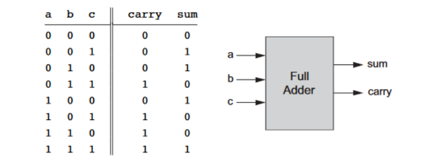

# Full Adder Chip

### Full Adder Chip

Full Adder chip is used to add 3-bits.

```nand2tetris-hdl
Chip name: FullAdder
Inputs: a, b, c
Outputs: sum, carry
Function: sum = LSB of a + b + c
carry = MSB of a + b + c
```



### Implementation of Full Adder Chip in HDL

The function in the above abstraction can help in the implementation of Full Adder Chip.


You can use the Half Adder Chip you've built earlier.l

sum = a XOR b XOR c

carry = (a AND b) OR (b AND c) OR (c AND a)


```nand2tetris-hdl
CHIP FullAdder {
    IN a, b, c;  // 1-bit inputs
    OUT sum,     // Right bit of a + b + c
        carry;   // Left bit of a + b + c

    PARTS:
    HalfAdder(a=a, b=b, sum=sumab, carry=carryab);
    HalfAdder(a=sumab, b=c, sum=sum, carry=temp);
    Or(a=temp, b=carryab, out=carry);
}
```

### Implementation of Full Adder Chip in Java™

_Similar to the Implementation in HDL_

```java
package CombChips;

class FullAdder_Gate extends HalfAdder_Gate {

    protected static int[] FullAdder(int a, int b, int c) {
        int[] out = new int[2];

        int[] ab = HalfAdder(a, b);
        int[] temp = HalfAdder(ab[0], c);
        int carry = Or_Gate.Or(temp[1], ab[1]);

        out[0] = temp[0];
        out[1] = carry;

        return out;
    }
}
```
