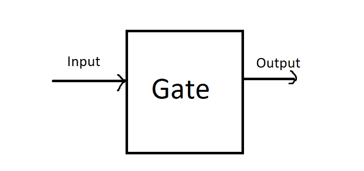

# Nand Gate

### **Gate**

A gate is a physical device that implements a Boolean function.



### Nand Gate

The starting point of Hack computer architecture is Nand Gate, from which all other gates and chips are built. Nand Gate is considered as primitive gate in nand2tetris course. You don't have to worry about its implementation for now.


### Implementation of Nand Gate in Java™

Unlike nand2tetris, Nand Gate in Java™ is implemented using "And" and "Or" operators.

```java
package CombChips;

import Misc.Convert;

class Nand_Gate {
    
    protected static int Nand(int a, int b) {
        boolean bool_a = Convert.Int2Bool(a);
        boolean bool_b = Convert.Int2Bool(b);

        boolean bool_final = (!bool_a || !bool_b);
        return Convert.Bool2Int(bool_final);
    }
}
```

One of the best practices in Java™ is to use the most restrictive that makes sense for a particular member.

In the above code, initially, the integral values are converted to boolean types using Int2Bool method from Convert class of Misc package. Then, the output of Or(not a, not b) \[best way to represent] is returned. In case you're wondering,


**Demorgan's law:**

**NAND = Not AND**

NOT(a AND b) = (NOT a) OR (NOT b)

!(a && b) = !a || !b

